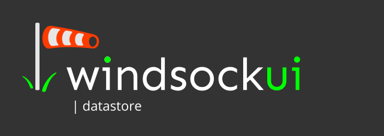

##| windsockui Introduction
`windsockui` is a dynamic content framework for vue.js that hydrates pages with content, for editable components. This allows developers to make their pages (and components) "editable" without needing their customers to login to an admin system. The goal is to allow front-end developers to claim back valuable territory from Wordpress. Developers create bespoke web sites with drop-in CMS functionality and a wide array of drop-in editable tailwind components. 


##| datastore
The datastore aspect (this project) is an open-source set of Java/Spring endpoints that serve content to the `|front-end cms` components. The datastore's authorization features allow components to upload updated content to the datastore for OpenID authorized users. Current implementation stores jsonb data inside a PostgreSQL database. 

## Setup
WindsockUI Datastore expects a Postgres database to be running with an empty database that it can access. The database configuration can be found in `/src/main/java/application.properties`

```properties
spring.datasource.url=jdbc:postgresql://localhost:5432/wsui-example
spring.datasource.username=postgres
spring.datasource.password=postgres
```

## Usage
There is only one endpoint implemented at the moment, fetching data. Fetching layouts and components will come later. For now...

To fetch data for a page, you request `/data/site/path`. An example would be
`http://localhost:8080/data/www.windsockui.com` (in this case there is no path specified, which returns `/` as the root). This example should work with the one line of test data.


## Issues
None 

